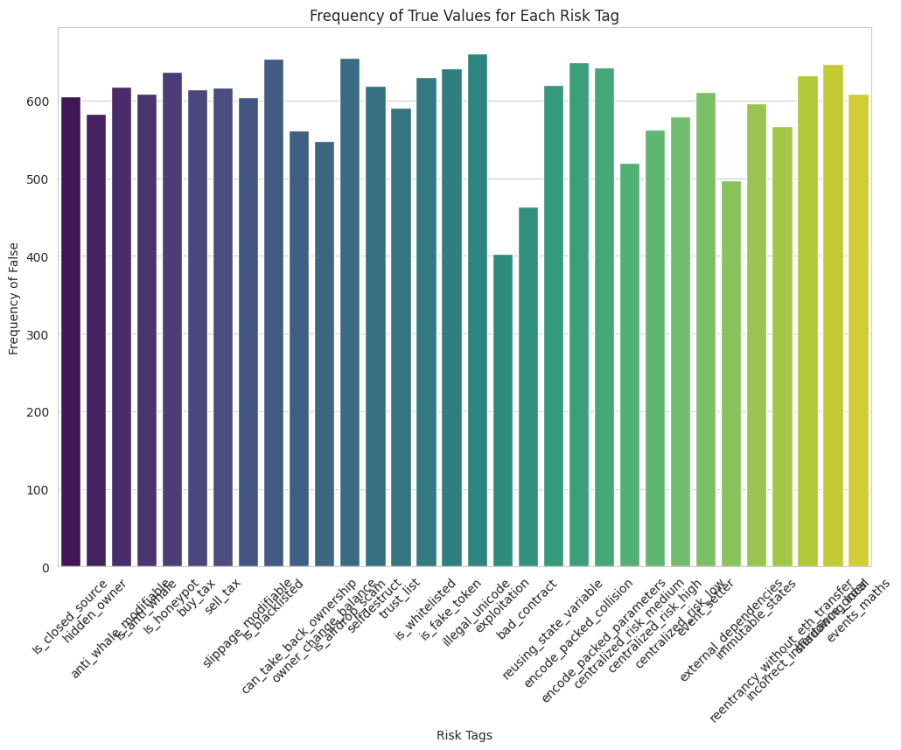
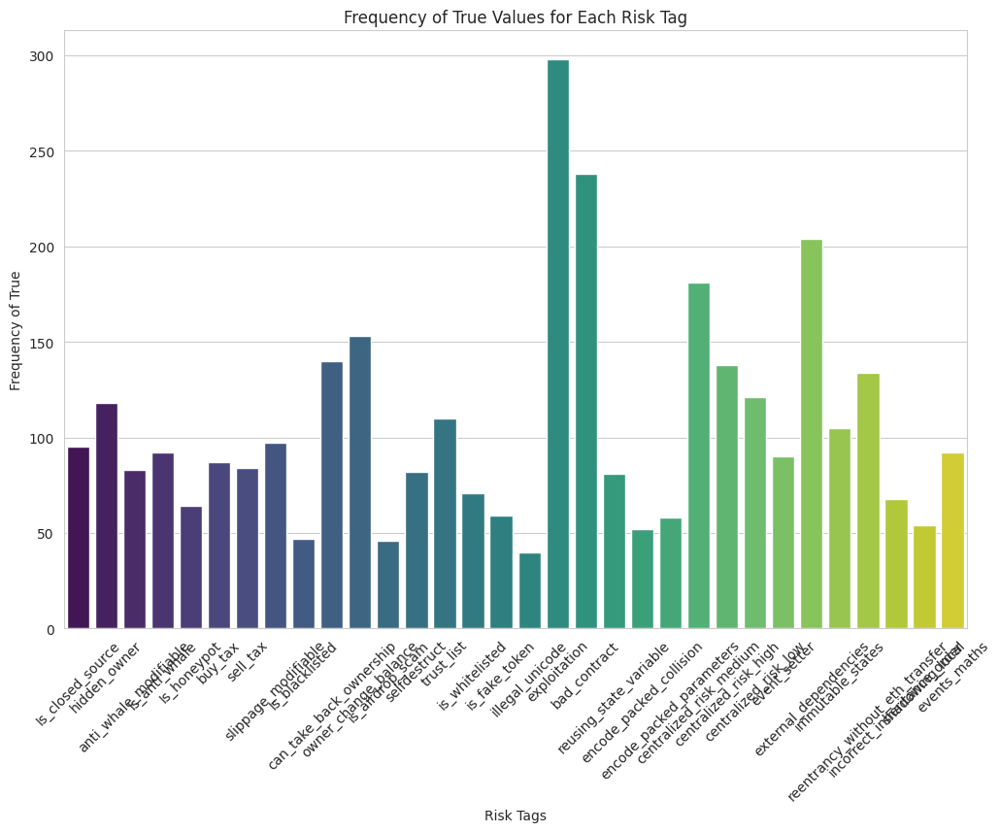
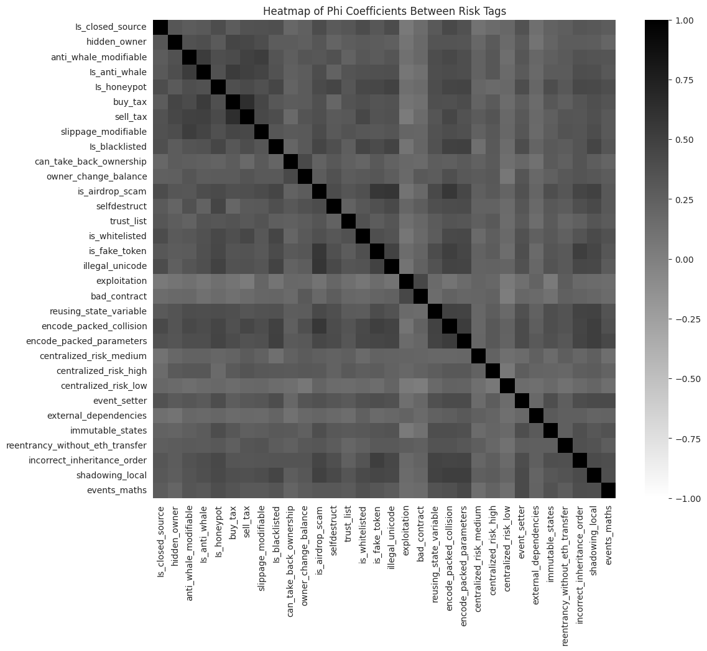

# 📊 Smart Contract Vulnerability Insights  
**Frequency & Correlation Analysis**

  
*🔍 A deep dive into smart contract risk patterns to improve blockchain security and audit readiness.*

---

## 🧠 Project Summary

This project explores the **frequency distribution** and **correlation** of vulnerability tags in smart contracts. By leveraging data visualization and statistical techniques, it equips developers, auditors, and DeFi users with a clearer understanding of how security risks cluster and co-occur.

---

## 🔍 Objective

- Identify the **most common smart contract vulnerabilities**.
- Analyze inter-risk **correlations using the Phi coefficient**.
- Uncover **co-occurring threat patterns** that evade isolated testing approaches.

---

## 🧪 Methodology

- Cleaned and structured a dataset of binary-labeled risk tags from smart contract audits.
- Visualized risk frequencies and co-occurrence patterns through histograms and a correlation heatmap.
- Applied **Phi correlation** to detect statistically significant relationships between vulnerabilities.
- Translated findings into **practical, actionable insights** for smart contract design and auditing.

---

## 📸 Visualizations

### 📊 Frequency Distribution (Before Cleaning)



> *Initial histogram showing the frequency of all risk tags, revealing heavy skew toward a few dominant vulnerabilities.*

---

### 🧹 Frequency Distribution (Filtered)



> *After filtering and cleaning, a clearer view of the top 15 vulnerabilities emerges—enabling more focused analysis.*

---

### 🔗 Risk Correlation Matrix



> *Phi correlation heatmap illustrating co-occurrence relationships. Strong positive correlations reveal which vulnerabilities tend to appear together within the same contracts.*

---

## 📈 Key Insights

- 🔁 **Reentrancy w/o ETH Transfer** is strongly correlated with **Packed Collision** (Φ ≈ 0.51).
- 🕵️ **Closed Source** contracts are commonly associated with **Hidden Owner** risks (Φ ≈ 0.32).
- 🚫 Surprisingly, **Blacklist Functions** show **low correlation** with **Centralization Risks**, challenging typical assumptions in DeFi risk modeling.
- 📊 Just **three risk types** account for **over 65%** of total risk tag occurrences, indicating a few systemic vulnerabilities dominate the landscape.

---

## 🛠️ Tools & Technologies

- **Python** (Pandas, Matplotlib, Seaborn)
- **Phi Correlation** via SciPy
- **Jupyter Notebook** for data wrangling and exploration
- **Data Cleaning** and **Statistical Visualization**

---

## 📚 Folder Structure

```bash
.
├── README.md
├── images/
│   ├── cover_image.png
│   ├── frequency_histogram.png
│   ├── frequency_histogram2.png
│   └── correlation_matrix.png
├── smart_contract_analysis.ipynb
├── data/
│   └── contract_risks.csv
```

---

## 🔐 Why It Matters

As smart contracts gain adoption, **understanding risk patterns** becomes critical. This analysis enhances security by revealing how vulnerabilities are distributed and interlinked—allowing teams to:

- Design smarter audits
- Spot red flags early
- Develop safer contracts for Web3 and DeFi ecosystems

---

## 🧾 Conclusion

Statistical analysis—especially through frequency trends and Phi correlation—offers powerful tools for smart contract risk management. This project demonstrates:

- How vulnerabilities **cluster** in real-world contracts
- Which risk tags deserve **immediate attention**
- Why correlation matters in understanding **compound threats**

---

## 💡 Next Steps

- 🔮 Integrate machine learning to predict risk-prone contracts.
- 🧠 Expand dataset with historical attack incidents.
- ⚙️ Automate identification of **high-risk combinations** during CI/CD pipelines.

---

## 🙌 About the Author

**Emeka Philian Ogbonna**  
Cybersecurity Analyst | Data Enthusiast | AI/ML | Blockchain Innovator  
[LinkedIn](https://www.linkedin.com/in/emekaogbonna/) • [GitHub](https://github.com/emekaphilian) • [Email](mailto:ogbonnaemeka665@gmail.com)

---

## 📢 Get Involved

If you're working on smart contract security, DeFi safety, or Web3 analytics, I’d love to connect. Let's collaborate to build a safer blockchain future.
```
