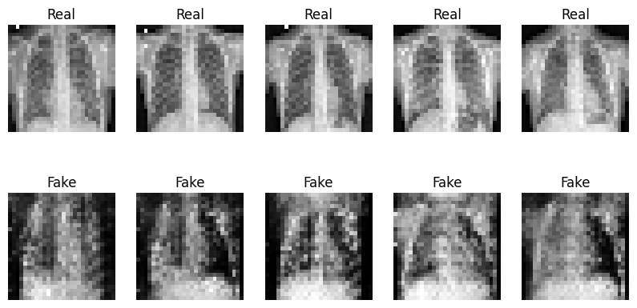

# 🧠 Building a Generative Adversarial Network with PyTorch (MNIST Dataset)
  
This project demonstrates how to build and train a simple Generative Adversarial Network (GAN) using the MNIST dataset. GANs are a class of deep learning models where two neural networks contest with each other to produce more realistic data — in this case, handwritten digits.

## 🚀 Project Goals

- Understand the fundamentals of GANs
- Build a Generator and Discriminator using PyTorch
- Train the GAN to generate realistic handwritten digits
- Visualize the training progress and outputs

## 🛠️ Technologies Used

- Python
- PyTorch
- Matplotlib
- NumPy
- torchvision (for MNIST dataset)

## 📁 Project Structure

```
📦 GAN_MNIST
 ┣ 📓 Building_a_Generative_Adversarial_Network_MNIST_Dataset.ipynb
 ┗ README.md
```

## 🧠 GAN Architecture

- **Generator:** Takes random noise and learns to produce digits that resemble real MNIST data.
- **Discriminator:** Learns to distinguish between real and generated digits.

## 📊 Training Progress

The model is trained using Binary Cross-Entropy Loss with Adam optimizer. Every few epochs, sample images are generated to visualize the progress.

## 🖼️ Sample Output



> *Note: Save generated images during training or use matplotlib to visualize at each epoch.*

## 📦 How to Run

1. Clone the repository:
   ```bash
   git clone https://github.com/yourusername/GAN_MNIST.git
   cd GAN_MNIST
   ```

2. Install dependencies:
   ```bash
   pip install -r requirements.txt
   ```

3. Run the notebook:
   ```bash
   jupyter notebook Building_a_Generative_Adversarial_Network_MNIST_Dataset.ipynb
   ```

## 🤝 Contributions

Pull requests are welcome. For major changes, please open an issue first to discuss your ideas.

## 📄 License

[MIT](LICENSE)
